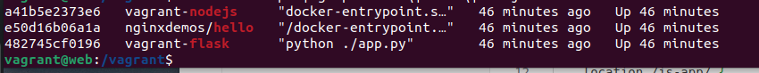
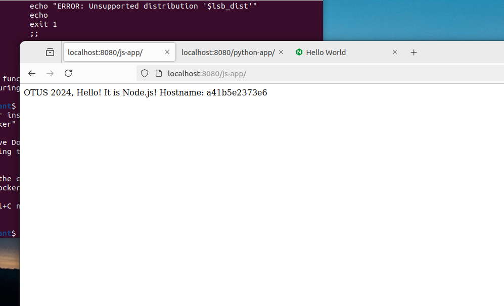
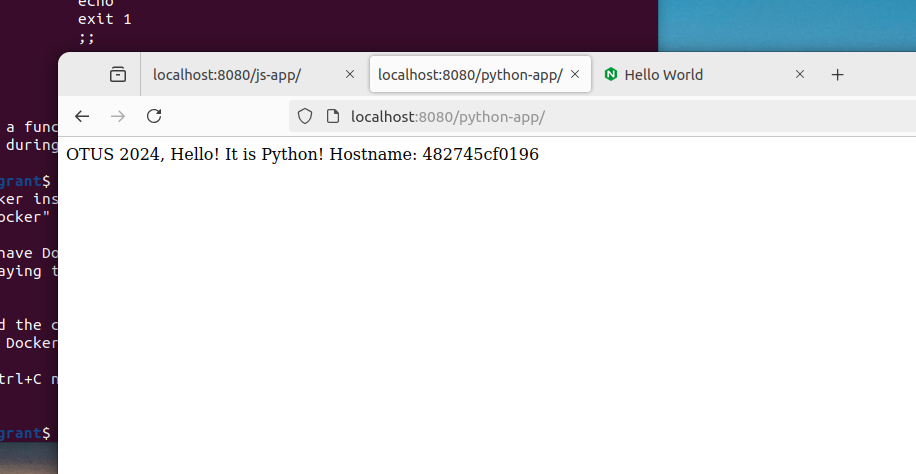
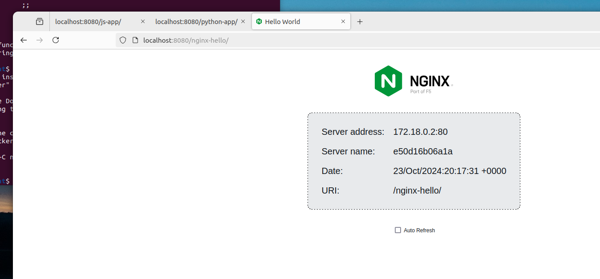

# homework-web

---
Описание домашнего задания

Цель: Получить практические навыки в настройке инфраструктуры с помощью манифестов и конфигураций; Отточить навыки использования ansible/vagrant/docker;

Варианты стенда:

nginx + php-fpm (laravel/wordpress) + python (flask/django) + js(react/angular); 

nginx + java (tomcat/jetty/netty) + go + ruby; 

**можно свои комбинации.**

Реализации на выбор: 

на хостовой системе через конфиги в /etc; 

**деплой через docker-compose.**


---
ОС для настройки: Ubuntu 22.04

Vagrant версии 2.4.1

VirtualBox версии 7.0.18


---
- Этап 1: Разворачиваем VM


Используем для этого Vagrantfile, после чего подключемся к виртуальной машине по ssh. 

**Примечание** для удобства в Vagrantfile примонтируем каталог хостовой машины

```bash
Vagrant.configure("2") do |web|
    web.vm.box = "ubuntu"
    web.vm.hostname = "web"

    web.vm.synced_folder ".", "/vagrant"
    web.vm.network "forwarded_port", guest: 8080, host: 8080

    web.vm.provision "shell", inline: <<-SHELL
        mkdir -p ~root/.ssh
        cp ~vagrant/.ssh/auth* ~root/.ssh
    SHELL
  end
```

**По причине того**, что у меня из-за слабых ресурсов регулярно вылетает VM, на которой делаю дз, выполним установку докера руками, хотя эти функции можно было бы отдать vagrant-у, описав их в секции provision

```bash
curl -fsSL https://get.docker.com -o get-docker.sh
# скачиваем и запускаем скрипт
sh get-docker.sh
```

---
- Этап 2: Разворачиваем web-приложения


Переходим в примонтированную директорию хостовой машины


```bash
cd /vagrant/
```

В этой директории уже лежат нужные файлы. Будут подгружены в репозиторий 

**Содержание:**

Flask-app - содержит файлы для приложения flask

nginx - хранит конфиг для nginx

node-app - содержит файлы для приложения NodeJS

docker-compose.yaml


**Поднимаем контейнеры с приложениями**

```bash
docker compose up -d 
```




---
- Этап 3: Проверка

Переходим в браузер и проверяем наши приложения 







